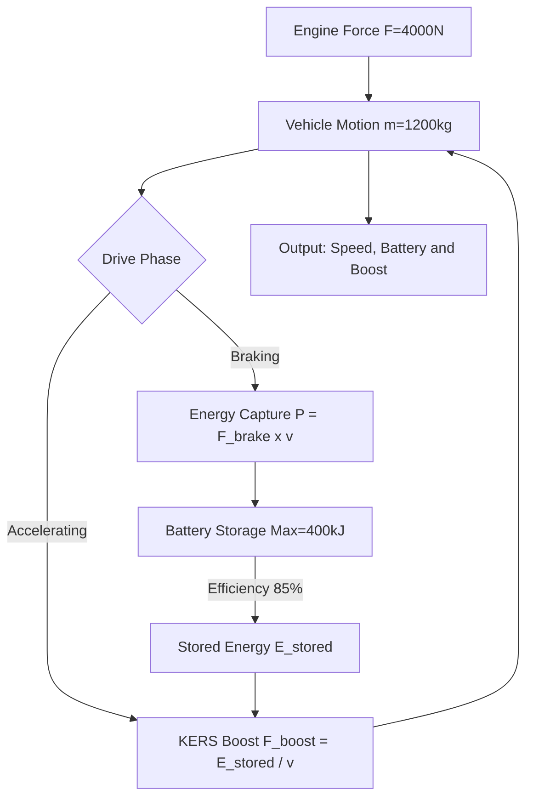
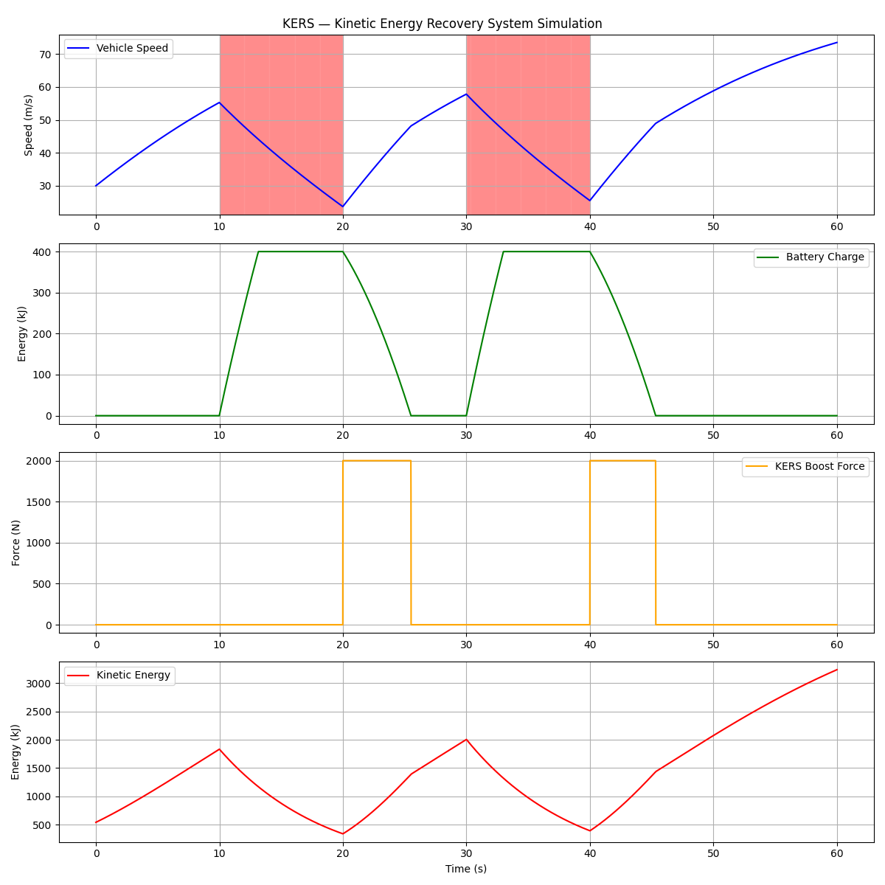

cat > README.md << 'ENDOFFILE'
# ⚡ KERS — Kinetic Energy Recovery System Simulation

A physics-based simulation of a Kinetic Energy Recovery System (KERS), modelling energy capture during braking and boost delivery during acceleration.

Built as **Phase 3** of my AI-Assisted Automotive Simulations series.

---

## 📐 System Architecture

---

## 📊 Simulation Results

### What the graph shows:
| Panel | What it represents |
|---|---|
| **Speed (Blue)** | Vehicle velocity across drive cycle |
| **Battery (Green)** | Energy stored during braking phases |
| **KERS Boost (Orange)** | Extra force delivered during acceleration |

---

## ⚙️ Physics Model

### Kinetic Energy:
KE = half x m x v squared

### Power during braking:
P = F_brake x v

### Battery charging:
E_stored += P x dt x efficiency

### KERS boost force:
F_boost = E_stored divided by (v x dt)

| Parameter | Symbol | Value |
|---|---|---|
| Vehicle Mass | m | 1200 kg |
| Initial Speed | v0 | 30 m/s = 108 km/h |
| Braking Force | F_brake | 3000 N |
| Engine Force | F_engine | 4000 N |
| KERS Efficiency | eta | 85% |
| Max Battery | E_max | 400 kJ |
| Max Boost Force | F_boost_max | 2000 N |

---

## 🚗 Drive Cycle

0s to 10s  — Acceleration engine only
10s to 20s — Braking KERS capturing energy
20s to 30s — Acceleration engine plus KERS boost
30s to 40s — Braking KERS capturing energy
40s to 60s — Acceleration engine plus KERS boost

---

## 🏎️ Real World Equivalent

| Car | KERS Power |
|---|---|
| Ferrari LaFerrari | 163 hp electric motor |
| McLaren P1 | 176 hp electric motor |
| Formula 1 2009+ | 80 hp recovery system |
| Toyota Prius | Regenerative braking |

---

## 🗂️ Project Structure

kers-simulation/
├── kers_simulation.py    # KERS physics simulation
├── kers_simulation.png   # Output graph
├── README.md             # This file
└── venv/                 # Python virtual environment

---

## 🛠️ Setup and Run

git clone https://github.com/MIz-1/kers-simulation.git
cd kers-simulation
python3 -m venv venv
source venv/bin/activate
pip install numpy matplotlib
python kers_simulation.py

---

## 🔭 Roadmap

- [x] Phase 1 — Aerodynamic Drag Simulator
- [x] Phase 2 — AI Smart Suspension System
- [x] Phase 3 — KERS Energy Recovery System
- [ ] Phase 4 — Combined Aero + Suspension + KERS

---

## 👨‍💻 About

Self-taught simulation developer exploring AI + automotive physics.
Student project — built for learning, not production.
ENDOFFILE

q
q
q
q
q
